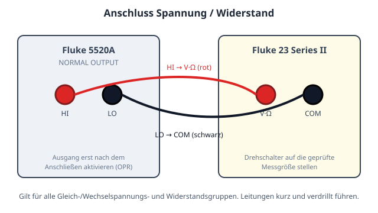
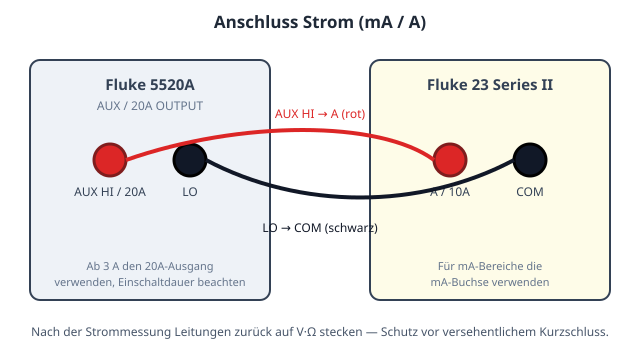
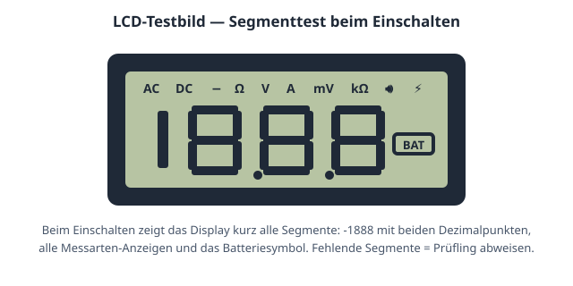

# Prüfplan: Fluke 23 Series II mit Fluke 5520A

Vollständiger Prüfablauf für ein **Fluke 23 Series II** Digitalmultimeter
(3200 Digits) gegen einen **Fluke 5520A** Kalibrator — 76 Schritte in
14 Messgruppen, im kanonischen calServer-Vorlagenformat
(`calserver.procedure`, Version 3), paketiert als
`calserver.procedure-package`.

## Paketinhalt

| Datei | Zweck |
| --- | --- |
| `manifest.json` | Manifest: jede Datei mit SHA-256-Prüfsumme und Größe |
| `procedure.json` | Der Prüfplan (76 Schritte, 14 Messgruppen) |
| `README.md` | Diese Beschreibung |
| `images/fluke-23-anschluss-v-ohm.svg` | Anschlussbild V/Ω/Diode (5520A ↔ Prüfling) |
| `images/fluke-23-anschluss-a.svg` | Anschlussbild mA/A (5520A ↔ Prüfling) |
| `images/fluke-23-lcd-testbild.svg` | LCD-Testbild für den Segmenttest |

Das Manifest ist der Manipulationsanker des Formats: calServer lehnt beim
Import jedes Paket ab, dessen Inhalt vom Manifest abweicht — in beide
Richtungen. Das maschinenlesbare Schema:
[`procedure-package.schema.json`](https://calhelp.github.io/calServer-reports/schema/procedure-package.schema.json).

## Import in calServer V2

1. **Kalibrierungen → Prüfpläne** (übergreifende Liste) öffnen
2. **Importieren** und das ZIP wählen — der Plan wird als neue Vorlage
   **Version 0.1** angelegt (der Freigabestand eines Quellsystems wird nie
   übernommen)
3. Über das Ketten-Symbol der Prozedur zuordnen, dann wie gewohnt
   genehmigen, freigeben, in eine Kalibrierung laden

Alternativ nimmt derselbe Import-Knopf auch das nackte `procedure.json` —
dann allerdings ohne die Bilder, die nur das Paket mitbringt.

## Schritt-Bilder (Dokumentversion 3)

Die Schritte referenzieren die Bilder aus `images/` per `images`-Feld;
calServer zeigt sie in der Messwertaufnahme und im Probelauf direkt am
Schritt. Die Messgruppen-Köpfe tragen ihr Anschlussbild, der
Abschlussschritt den Segmenttest als Ja/Nein-Frage (`TEXT(Y=PASS)`):

## Was die Gruppenebene hier trägt

Am Gruppenkopf stehen `test_value_p`, `test_value_u`, `range`, `resolution`,
`tolerance`, `uncertainty`, `k` und `decision_rule`: 44 Messpunkte kommen
ohne eine einzige eigene Toleranz-, Auflösungs- oder Unsicherheitsangabe
aus. Ein Wechsel des Normals ist eine Änderung an vierzehn Gruppenköpfen
statt an vierundvierzig Zeilen.

Jede der fünf DC-Spannungsgruppen schließt mit einem **Umpolungspunkt** ab
(−300 mV, −3 V, −30 V, −300 V, −1000 V): derselbe Betrag wie der größte
positive Punkt der Gruppe, Normal umgepolt, Prüfling nicht umgeklemmt.

## Zahlenwerte prüfen, bevor sie produktiv gehen

Die Toleranzen sind nach den Herstellerangaben für den Fluke 23 Series II
angesetzt (`0.3% 1D` bei V DC, `1.5% 3D` bei V AC, `0.5% 2D` bei Ω, …).
**Sie sind gegen das Datenblatt in der beim Prüfling gültigen Ausgabe zu
prüfen**, bevor damit bewertet wird; Datenblattrevisionen unterscheiden
sich, und die Fehlergrenze ist die eine Zahl, die man nicht aus einem
Beispiel übernimmt.

Dasselbe gilt für die Unsicherheiten: Sie sind als plausible erweiterte
Messunsicherheit (k = 2) des jeweiligen Aufbaus angesetzt und ersetzen kein
eigenes Budget. Der niedrigste TUR liegt bei 4,4:1 (10 % vom 10-A-Bereich);
alle anderen Punkte liegen deutlich darüber.
