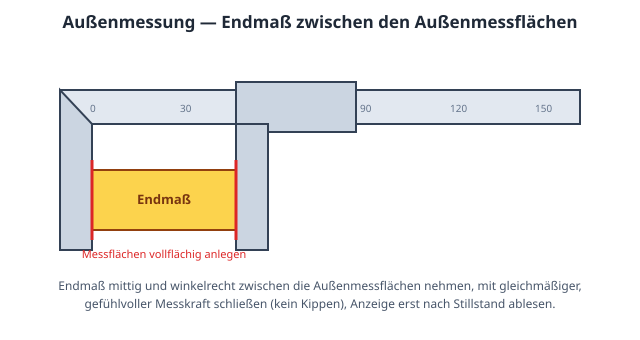
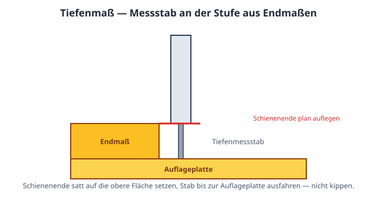

# Prüfplan: Messschieber 150 mm mit Endmaßsatz

Vollständiger Prüfablauf für einen **Messschieber 0–150 mm**
(Ziffernschrittwert 0,01 mm) gegen einen **Endmaßsatz nach DIN EN ISO 3650
Klasse 1** — 34 Schritte in 3 Messgruppen, im kanonischen
calServer-Vorlagenformat (`calserver.procedure`, Version 3), paketiert als
`calserver.procedure-package`.

## Paketinhalt

| Datei | Zweck |
| --- | --- |
| `manifest.json` | Manifest: jede Datei mit SHA-256-Prüfsumme und Größe |
| `procedure.json` | Der Prüfplan (34 Schritte, 3 Messgruppen) |
| `README.md` | Diese Beschreibung |
| `images/messschieber-aussenmessung.svg` | Messanleitung Außenmessung (Endmaß zwischen den Messflächen) |
| `images/messschieber-innenmessung.svg` | Messanleitung Innenmessung (Einstellring) |
| `images/messschieber-tiefenmass.svg` | Messanleitung Tiefenmaß (Stufe aus Endmaßen) |

Das Manifest ist der Manipulationsanker des Formats: calServer lehnt beim
Import jedes Paket ab, dessen Inhalt vom Manifest abweicht — in beide
Richtungen. Das maschinenlesbare Schema:
[`procedure-package.schema.json`](https://calhelp.github.io/calServer-reports/schema/procedure-package.schema.json).

## Import in calServer V2

1. **Kalibrierungen → Prüfpläne** (übergreifende Liste) öffnen
2. **Importieren** und das ZIP wählen — der Plan wird als neue Vorlage
   **Version 0.1** angelegt (der Freigabestand eines Quellsystems wird nie
   übernommen)
3. Über das Ketten-Symbol der Prozedur zuordnen, dann wie gewohnt
   genehmigen, freigeben, in eine Kalibrierung laden

Alternativ nimmt derselbe Import-Knopf auch das nackte `procedure.json` —
dann allerdings ohne die Bilder, die nur das Paket mitbringt.

## Schritt-Bilder (Dokumentversion 3)

Jeder Messgruppen-Kopf referenziert seine Messanleitung aus `images/` per
`images`-Feld; calServer zeigt sie in der Messwertaufnahme und im
Probelauf direkt am Schritt — wie messen, nicht nur was:

## Der TUR ist hier Absicht

Die Gruppe **Außenmessflächen** kommt auf TUR 4,3:1 und läuft warnungsfrei
durch. **Innenmessflächen** (3:1) und **Tiefenmaß** (2,5:1) lösen die
TUR-Warnung des Editors aus — und das ist die richtige Antwort: gegen eine
Fehlergrenze von ±0,03 mm bei 0,01 mm Ziffernschrittwert bleibt kein Platz
für 4:1, sobald die Anlage schlechter definiert ist. Wer dort 4:1 braucht,
misst nicht mit dem Messschieber. Die beiden Gruppenköpfe sagen das im Feld
„Durchführung" auch so.

## Zahlenwerte prüfen, bevor sie produktiv gehen

Die Toleranz ist nach DIN 862 angesetzt (±0,03 mm im Bereich 0–150 mm,
aufgerundet aus ±(20 µm + L/50)). **Sie ist gegen das Datenblatt in der beim
Prüfling gültigen Ausgabe zu prüfen**, bevor damit bewertet wird. Die
Unsicherheiten sind als plausible erweiterte Messunsicherheit (k = 2) des
Aufbaus angesetzt und ersetzen kein eigenes Budget.
